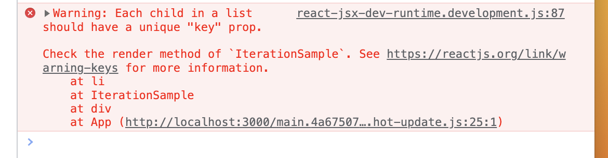

# 컴포넌트 반복

불필요한 코드 반복을 개선하기 위해서 배열 객체의 내장 함수인 map 함수를 사용하여 반복되는 컴포넌트를 렌더링할 수 있다.

반복되는 컴포넌트에서 가장 유의해야할 사항은 고유값의 key값이다.

```javascript
const IterationSample = () => {
  const names = ["눈사람", "얼음", "눈", "바람"];
  const nameList = names.map((name) => <li>{name}</li>);
  return <ul>{nameList}</ul>;
};

export default IterationSample;
```


위와 key 값이 없을 경우 고유의 key prop이 없다는 경고 메세지가 뜬다.

<br/>

## 🔑 key값이 필요한 이유!

key가 없을 때는 Virtual DOM을 비교하는 과정에서 **리스트를 순차적으로** 비교하면서 변화를 감지한다. 하지만 **key가 있다면** 이 값을 사용하여 **어떤 변화가 일어났는지 더욱 빠르게 알아낼 수 있다.**
<br/>
이때 고유한 값이 없다면 index값을 key로 사용한다. 하지만 이 방법은 배열이 변경될 때 **효율적으로 리렌더링하지 못한다.**

<br/>

## 배열에 항목 추가 및 제거하기

```javascript
import { useState } from "react";

const IterationSample = () => {
  const [names, setNames] = useState([
    { id: 1, text: "자이언티" },
    { id: 2, text: "아이유" },
    { id: 3, text: "정승환" },
    { id: 4, text: "머라이어캐리" },
  ]);

  const [id, setId] = useState(5);
  const [inputText, setinputText] = useState("");

  const onClick = () => {
    const nextNames = names.concat({
      id: id,
      text: inputText,
    });
    setId(id + 1);
    setNames(nextNames);
    setinputText("");
  };
  const onChange = (e) => {
    setinputText(e.target.value);
  };

  const onRemove = (id) => {
    const nextNames = names.filter((name) => name.id !== id);
    setNames(nextNames);
  };

  const nameList = names.map((name) => (
    <li
      key={name.id}
      onDoubleClick={() => {
        onRemove(name.id);
      }}
    >
      {name.text}
    </li>
  ));

  return (
    <div>
      <input value={inputText} onChange={onChange} />
      <button onClick={onClick}>추가하기</button>
      <ui>{nameList}</ui>
    </div>
  );
};

export default IterationSample;
```

<br/>

### ⭐️ 불변성 유지 ⭐️

**불변성 유지**(= 기존 상태를 그대로 두면서 새로운 값을 상태로 설정)는 리액트 컴포넌트의 성능을 최적화할 수 있는 중요한 특징이다.<br/>
위 코드에서도 배열에 대해 push와 **같은 기존 배열 자체륿 변경해주는 메소드가 아닌 새로운 배열을 만들어주는** concat, filter등을 사용한 것을 확인할 수 있다.
