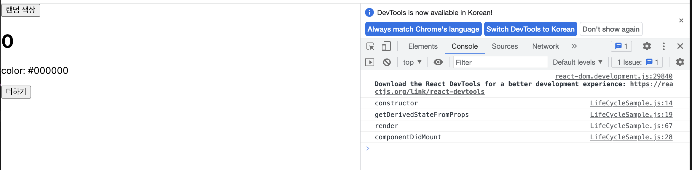
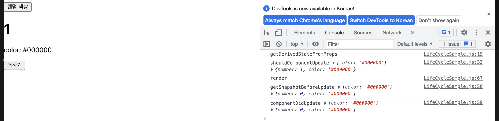
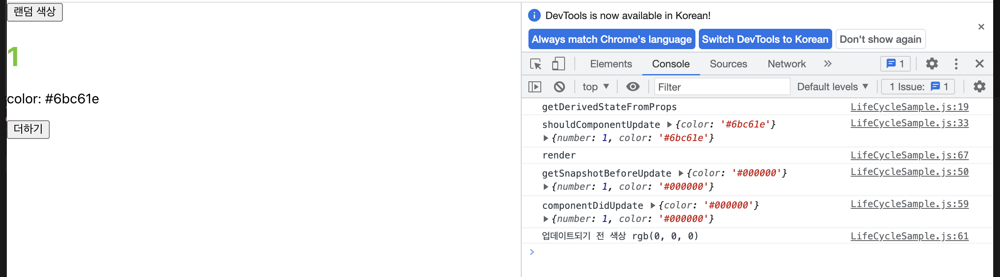
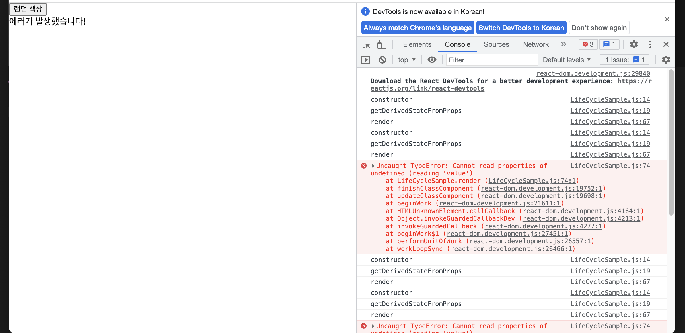

# 컴포넌트의 라이프사이클 메서드

`LifeCycleSample.js`

```javascript
import { Component } from "react";

class LifeCycleSample extends Component {
  state = {
    number: 0,
    color: null,
  };

  myRef = null;

  constructor(props) {
    // 컴포넌트를 만들 때 처음으로 실행
    super(props);
    console.log("constructor");
  }

  static getDerivedStateFromProps(nextProps, prevState) {
    // 마운트될 때와 업데이트될때 호출된다.
    console.log("getDerivedStateFromProps");
    if (nextProps.color !== prevState.color) {
      return { color: nextProps.color };
    }
    return null; // state를 변경할 필요가 없다면 null 반환
  }

  componentDidMount() {
    // 컴포넌트를 만들고, 첫 렌더링을 다 마친 후 실행
    console.log("componentDidMount");
  }

  shouldComponentUpdate(nextProps, nextState) {
    //props 또는 state를 변경했을 때, 리렌더링 결정 메서드 값에 따라 업데이트 여부 판단됨.
    console.log("shouldComponentUpdate", nextProps, nextState);
    return nextState.number % 10 !== 4;
  }

  componentWillUnmount() {
    //제거할때 실행
    console.log("componentWillUnmount");
  }

  handleClick = () => {
    this.setState({
      number: this.state.number + 1,
    });
  };

  getSnapshotBeforeUpdate(preProps, prevState) {
    //render에서 만들어진 결과물이 브라우저에 실제로 반영되기 직전에 호출
    console.log("getSnapshotBeforeUpdate", preProps, prevState);
    if (preProps.color !== this.props.color) {
      return this.myRef.style.color;
    }
    return null;
  }

  componentDidUpdate(preProps, prevState, snapshot) {
    // 리렌더링을 완료한 후 실행 > 업데이트가 끝난 직후
    console.log("componentDidUpdate", preProps, prevState);
    if (snapshot) {
      console.log("업데이트되기 전 색상", snapshot);
    }
  }

  render() {
    // 필수 메서드
    console.log("render");

    const style = {
      color: this.props.color,
    };

    return (
      <div>
        // {this.props.missing.value} 에러코드
        <h1 style={style} ref={(ref) => (this.myRef = ref)}>
          {this.state.number}
        </h1>
        <p>color: {this.state.color}</p>
        <button onClick={this.handleClick}>더하기</button>
      </div>
    );
  }
}

export default LifeCycleSample;
```

`ErrorBoundary.js`

```javascript
import { Component } from "react";

class ErrorBoundary extends Component {
  state = {
    error: false,
  };

  componentDidCatch(error, info) {
    this.setState({
      error: true,
    });
    console.log({ error, info });
  }
  render() {
    if (this.state.error) return <div> 에러가 발생했습니다!</div>;
    return this.props.children;
  }
}
export default ErrorBoundary;
```

`app.js`

```javascript
import { Component } from "react";
import LifeCycleSample from "./LifeCycleSample";
import ErrorBoundary from "./ErrorBoundary";

function getRandomColor() {
  return "#" + Math.floor(Math.random() * 16777215).toString(16);
}

class App extends Component {
  state = {
    color: "#000000",
  };

  handleClick = () => {
    this.setState({
      color: getRandomColor(),
    });
  };

  render() {
    return (
      <div>
        <button onClick={this.handleClick}>랜덤 색상</button>
        <ErrorBoundary>
          <LifeCycleSample color={this.state.color} />
        </ErrorBoundary>
      </div>
    );
  }
}
export default App;
```





